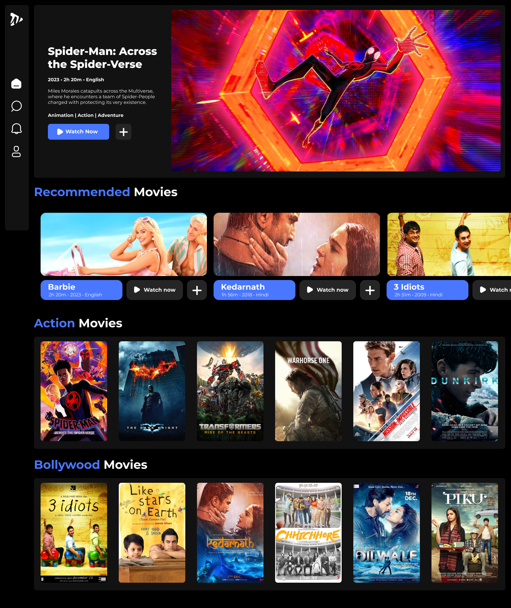

# Watch Together

Watch Together is a web application that allows users to watch movies together in real time with their friends, featuring synchronized video playback and voice chat functionality. This app is built using modern web technologies such as Next.js, Tailwind CSS, Express.js, and integrates with third-party services like Firebase, Clerk, and TMDB API.


## Watch Party App with Voice Chat Integration



## Features

- **Watch Together**: Synchronized video playback for a shared watching experience.
- **Voice Chat**: Talk with friends in real-time while watching the movie.
- **User Authentication**: Integrated user sign-up, login, and session management via Clerk.
- **Movie Fetching**: Utilizes the TMDB API to fetch movie data.
- **Live Interaction**: Real-time communication with Socket.IO.
- **Responsive Design**: Built with Tailwind CSS for a seamless experience across devices.
- **Backend Support**: Powered by Express.js for handling server-side functionality.

## Technologies Used

- **Frontend**: Next.js, Tailwind CSS
- **Backend**: Express.js (Node.js)
- **Real-time Communication**: Socket.IO
- **Authentication**: Clerk for user management and authentication.
- **Database**: Firebase for storing session and user data.
- **Movie Data**: TMDB API for fetching movie information.
- **Deployment**: Deployed on [your hosting service if applicable].

## Installation

Follow these steps to set up the project locally:

1. Clone the repository:
   ```bash
   git clone https://github.com/kashyapvelani/WatchTogether.git
   cd WatchTogether
   ```
# Install dependencies for both frontend and backend:
   ```bash
    npm install
   ```
# Set up environment variables:
Create a .env file with the following variables:
```bash
NEXT_PUBLIC_TMDB_API_KEY=your_tmdb_api_key
NEXT_PUBLIC_CLERK_SIGN_IN_URL='/login'
NEXT_PUBLIC_CLERK_SIGN_UP_URL='/signup'
NEXT_PUBLIC_CLERK_AFTER_SIGN_IN_URL='/'
NEXT_PUBLIC_CLERK_AFTER_SIGN_UP_URL='/login'
SOCKET_PORT=your_socket_port
FIREBASE_API_KEY=your_firebase_api_key
FIREBASE_PROJECT_ID=your_firebase_project_id
CLERK_API_KEY=your_clerk_api_key
NEXT_PUBLIC_CLERK_PUBLISHABLE_KEY = your_clerk_publishable_key
```
# Run the App
## Backend server
```bash
npm run node
```
## Next App
```bash
npm run dev
```
The frontend will be running on ```http://localhost:3000```, and the backend on ```http://localhost:5000```.

# Contributing
We welcome contributions to Watch Together! If you'd like to contribute, please follow these steps:

1. Fork the repository
2. Create a new branch for your feature
3. Commit your changes
4. Push to your branch
5. Create a new Pull Request

# Acknowledgements
- [Clerk](https://clerk.com/docs/quickstarts/nextjs) for user authentication.
- [Firebase](https://firebase.google.com) for database support.
- [TMDB API](https://www.themoviedb.org/documentation/api) for movie data.
- [Socket.IO](https://socket.io/docs/v4/server-installation/) for real-time communication.
- [Tailwind CSS](https://tailwindcss.com/docs/installation) for UI styling.
